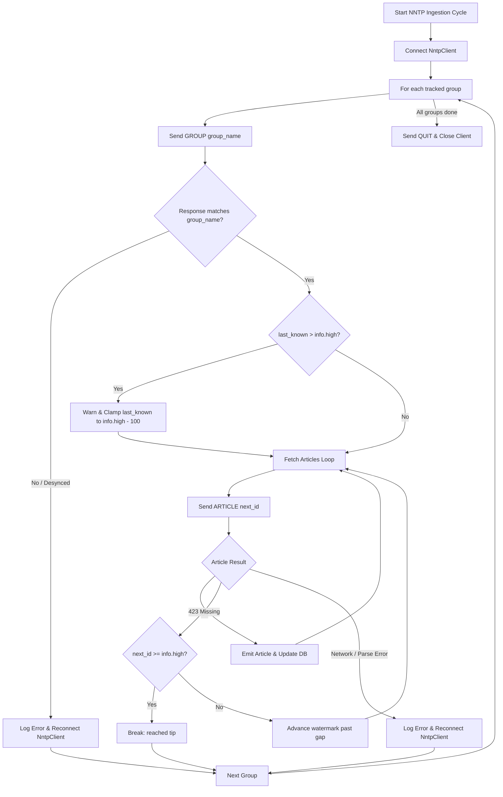

# Design: NNTP Ingestion Resilience & Desync Protection

## Status
Proposed

## 1. Overview & Problem Statement

Sashiko continuously ingests emails and patches from public kernel mailing lists hosted on lore.kernel.org via NNTP (`nntp.lore.kernel.org`). In production, this tracks over 80 mailing lists sequentially in periodic cycles (`process_nntp_cycle`).

On August 27, 2026, ingestion of `linux-nfs@vger.kernel.org` stalled completely. An investigation into the production environment revealed:
1. In the database `mailing_lists` table, the high-water mark (`last_article_num`) for `org.kernel.vger.linux-nfs` was recorded as `145742`.
2. On `nntp.lore.kernel.org`, the tip of `org.kernel.vger.linux-nfs` was only `144382` (and on August 27 was ~144230).
3. The ingestion loop (`while current < info.high`) never executed because `last_known > info.high`, causing all new patches and emails sent solely to `linux-nfs` to be ignored.
4. Eight other mailing lists suffered from the same issue (including `linux-cifs`, `imx`, and `linux-modules`).

### Root Causes

1. **Protocol Desynchronization on Shared TCP Connection**:
   In `process_nntp_cycle`, a single `NntpClient` connection is shared across all tracked groups in a loop. When an error or timeout occurs during article fetching (e.g. timeout on a large payload), the loop breaks for the current group but continues to the next group using the **same TCP stream**. Because unconsumed response data remains in the socket buffer, subsequent NNTP commands read offset responses. For example, a `GROUP` command for `linux-nfs` read the `211` response intended for `linux-mm`, adopting `linux-mm`'s higher article count (`high = 591939`).

2. **Missing Group Name Validation**:
   `NntpClient::group` parsed `211 <count> <low> <high> <group>` but did not verify that `<group>` matched the requested group name. A desynchronized response was thus accepted blindly.

3. **Unbounded Missing Article Skipping**:
   When receiving a `423 No such article number` error while evaluating against an inflated `info.high`, `sashiko` treated it as "missing below tip, skipping" and updated `last_article_num` up to the inflated value.

4. **No Self-Healing for Inverted High-Water Marks**:
   If `last_known > info.high` (whether due to server renumbering, NNTP mirror resets, or client-side desync), `sashiko` had no logic to detect or repair the condition, permanently stalling ingestion for that list.

---

## 2. Architectural Solution

---

## 3. Detailed Changes

### 3.1 NntpClient Group Name Validation (`src/nntp.rs`)
In `NntpClient::group`, verify `parts[4] == group_name`. If the server response contains a different group name, return an explicit error (`Mismatched GROUP response: expected X, got Y`).

### 3.2 Error-Triggered Reconnection (`src/ingestor.rs`)
In `process_nntp_cycle`:
- When an article fetch fails with an unexpected error (not 423), reconnect the client immediately so subsequent groups start with a fresh TCP stream.
- When `group()` fails (including mismatched group responses), reconnect the client before proceeding.

### 3.3 Automatic High-Water Mark Recovery (`src/ingestor.rs`)
In `process_nntp_cycle`:
- If `current > info.high`:
  - Log a warning indicating that the database high-water mark exceeds the server tip.
  - Reset `current = info.high.saturating_sub(100)`.
  - Persist the clamped watermark to the database so that the list resumes ingesting without manual operator intervention.
